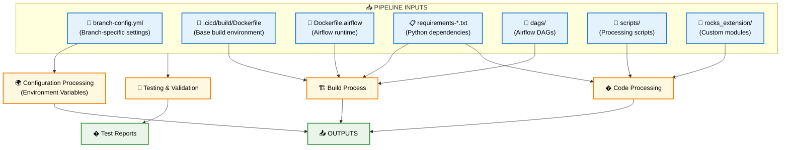
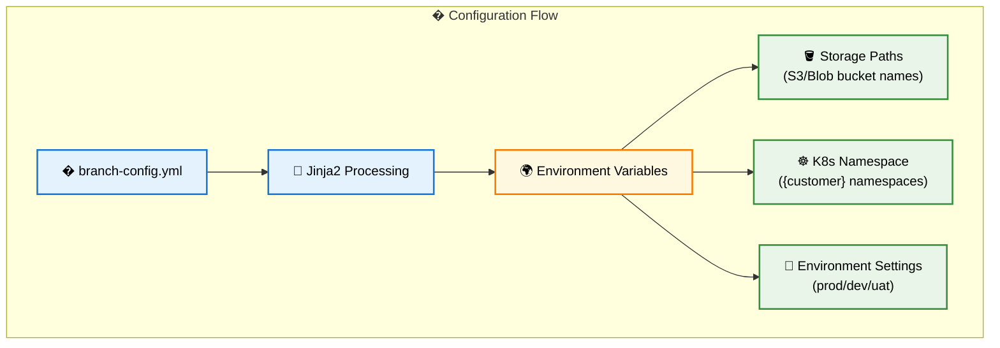
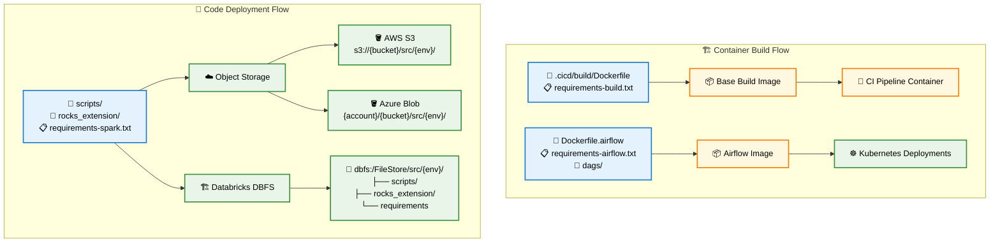
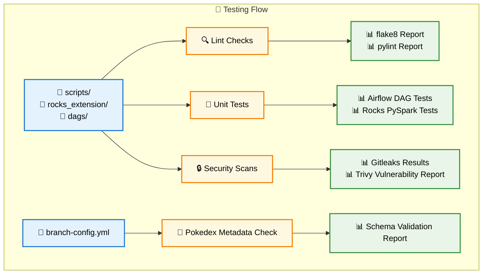

# CI/CD Pipeline - Input to Output Mapping

## 🎯 **Pipeline Flow with Input-Output Relationships**



## 🔍 **Detailed Input Processing**



## 🏗️ **Build & Deployment Flow**



## 🧪 **Testing & Validation Flow**



## 📊 **Input-Output Relationship Matrix**

| Input | Tests Generated | Deployments Generated |
|-------|----------------|----------------------|
| **📄 branch-config.yml** | 🦄 Pokedex Metadata Check | ☁️ All storage paths, ☸️ K8s namespace |
| **🐳 .cicd/build/Dockerfile** | 🔒 Security Scans | 📦 Base Build Image |
| **🐳 Dockerfile.airflow** | 🔒 Security Scans | 📦 Airflow Image, ☸️ K8s deployments |
| **📋 requirements-*.txt** | 🔒 Security Scans | 📦 Both container images |
| **🎯 dags/** | 🔍 Lint, 🎯 Airflow Tests, 🔒 Security | 📦 Airflow Image, ☸️ K8s deployments |
| **📜 scripts/** | 🔍 Lint, 🔒 Security Scans | ☁️ Storage, 🏗️ DBFS |
| **🔧 rocks_extension/** | 🔍 Lint, 🗿 Rocks Tests, 🔒 Security | ☁️ Storage, 🏗️ DBFS |

## 🔗 **Detailed Input-Output Mappings**

### **📄 branch-config.yml → Configuration**
```yaml
Drives all environment variables:
├── Storage bucket names → AWS S3 / Azure Blob paths
├── Kubernetes namespace → K8s deployment target
├── Environment settings → ROCKS_ENV, POKEDEX_ENVIRONMENT
└── Customer settings → All {customer} placeholders
```

### **🐳 .cicd/build/Dockerfile → Base Build Image**
```bash
Input: .cicd/build/Dockerfile + requirements-build.txt
Output: inventkubernetes.azurecr.io/base-images/pipeline-build-image:{hash}
Used by: All subsequent CI/CD jobs for testing and building
```

### **🐳 Dockerfile.airflow → Airflow Runtime**
```bash
Input: Dockerfile.airflow + requirements-airflow.txt + dags/
Output: 
├── Container: inventkubernetes.azurecr.io/airflow/{customer}-{env}:{version}
└── K8s Deployments: airflow-scheduler, airflow-webserver, airflow-worker
```

### **📋 requirements-*.txt → Dependencies**
```bash
requirements-build.txt → Base build image dependencies
requirements-airflow.txt → Airflow runtime dependencies  
requirements-spark.txt → Databricks/Spark execution dependencies
All → Security vulnerability scanning
```

### **🎯 dags/ → Airflow Orchestration**
```bash
Testing:
├── Lint checks (Python syntax/style)
├── DAG import validation
├── Task dependency verification
└── Security scanning

Deployment:
├── Packaged into Airflow container image
└── Deployed to Kubernetes Airflow pods
```

### **📜 scripts/ → Processing Logic**
```bash
Testing:
├── Lint checks (flake8, pylint)
└── Security scanning (secrets, vulnerabilities)

Deployment:
├── AWS S3: s3://{DATASTORE_BUCKET}/src/{ROCKS_ENV}/scripts/
├── Azure Blob: {STORAGE_ACCOUNT}/{DATASTORE_BUCKET}/src/{ROCKS_ENV}/scripts/
└── DBFS: dbfs:/FileStore/src/{ROCKS_ENV}/scripts/
```

### **🔧 rocks_extension/ → Custom Modules**
```bash
Testing:
├── Lint checks (code quality)
├── Unit tests (PySpark functionality)
└── Security scanning

Deployment:
├── AWS S3: s3://{DATASTORE_BUCKET}/src/{ROCKS_ENV}/rocks_extension/
├── Azure Blob: {STORAGE_ACCOUNT}/{DATASTORE_BUCKET}/src/{ROCKS_ENV}/rocks_extension/
└── DBFS: dbfs:/FileStore/src/{ROCKS_ENV}/rocks_extension/
```

## 🎯 **Key Insights**

### **Multi-Output Inputs**
- **📄 branch-config.yml**: Affects ALL deployment paths and configurations
- **🔒 Security Scans**: Applied to ALL code inputs for comprehensive coverage
- **📜 scripts/ & 🔧 rocks_extension/**: Deploy to ALL three storage systems (S3/Blob + DBFS)

### **Specialized Outputs**
- **📦 Container Images**: Built from specific Dockerfiles + requirements
- **☸️ Kubernetes**: Receives Airflow images + configuration from branch-config
- **🧪 Tests**: Each input type has targeted validation (linting, unit tests, security)

### **Configuration Cascade**
The **branch-config.yml** acts as the central configuration source that determines:
- Where everything gets deployed (bucket names, namespaces)
- What environment settings are used (prod/dev/uat)
- How resources are named and organized

This mapping shows how each input file has a specific purpose and creates targeted outputs across both testing and deployment phases! 🚀