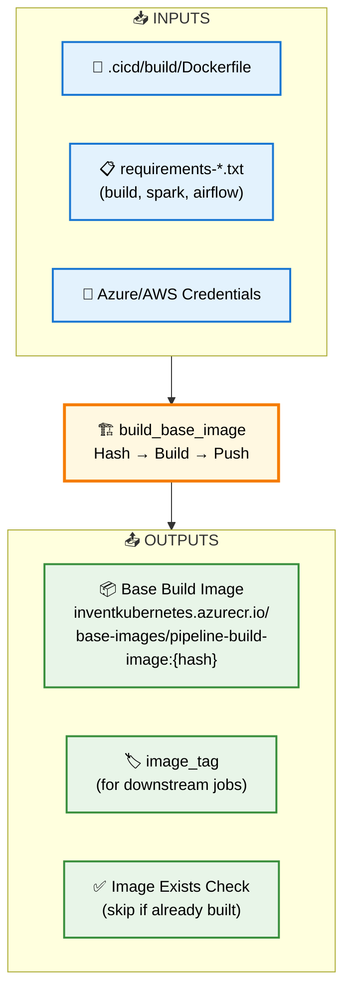
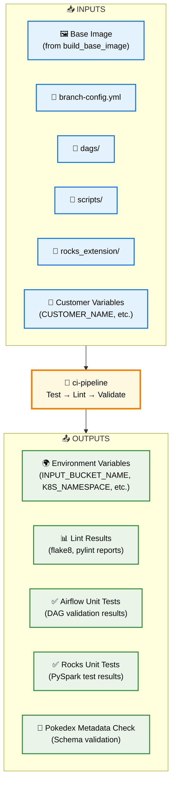
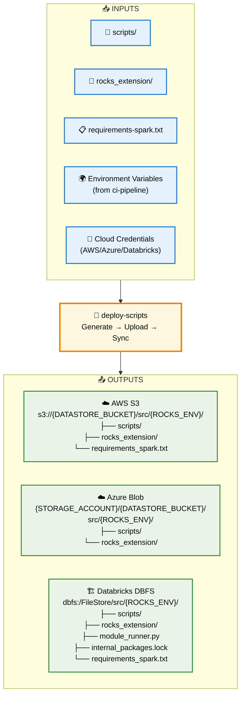
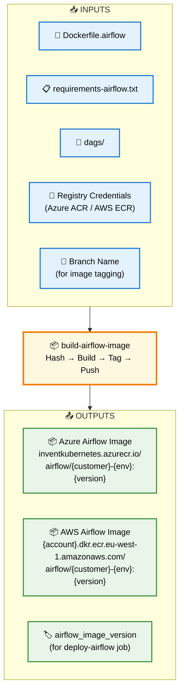
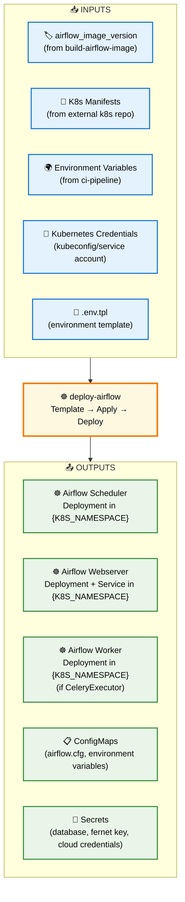
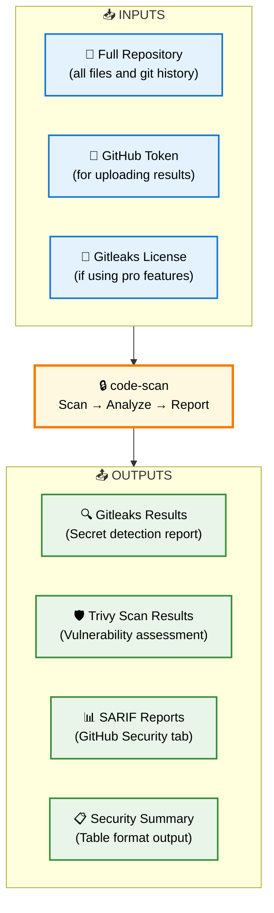
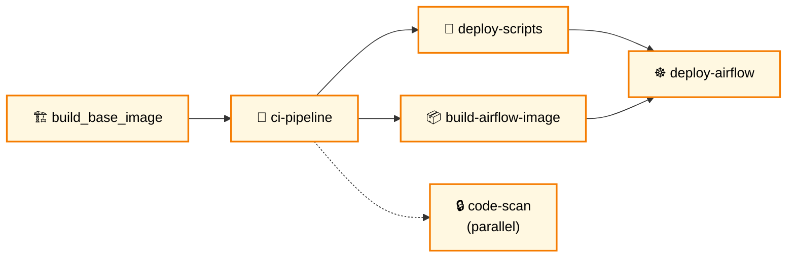

# CI/CD Jobs - Individual Input/Output Diagrams

## 🏗️ **Job 1: `build_base_image`**

---

## 🧪 **Job 2: `ci-pipeline`**

---

## 🚀 **Job 3: `deploy-scripts`**

---

## 📦 **Job 4: `build-airflow-image`**

---

## ☸️ **Job 5: `deploy-airflow`**

---

## 🔒 **Bonus Job: `code-scan` (Parallel)**

## 📊 **Job Dependencies Summary**

## 🎯 **Key Job Characteristics**

| Job | Type | Duration | Dependencies | Parallel? |
|-----|------|----------|--------------|-----------|
| **🏗️ build_base_image** | Build | ~5-10 min | None | ❌ |
| **🧪 ci-pipeline** | Test | ~10-15 min | build_base_image | ❌ |
| **🚀 deploy-scripts** | Deploy | ~3-5 min | ci-pipeline ✅ | ❌ |
| **📦 build-airflow-image** | Build | ~5-8 min | ci-pipeline ✅ | ✅ (with deploy-scripts) |
| **☸️ deploy-airflow** | Deploy | ~2-3 min | deploy-scripts + build-airflow-image | ❌ |
| **🔒 code-scan** | Security | ~2-5 min | None | ✅ (fully parallel) |

## 💡 **Optimization Notes**

- **🏗️ Base image**: Uses hash-based caching - skips rebuild if image exists
- **📦 Airflow image**: Version-based tagging prevents unnecessary rebuilds  
- **🚀 Scripts deployment**: Runs in parallel with Airflow image build for efficiency
- **🔒 Security scanning**: Runs completely parallel to save time
- **☸️ K8s deployment**: Only runs after all dependencies complete successfully

Each job has a **clear purpose** and **well-defined inputs/outputs**, making the pipeline **modular** and **maintainable**! 🚀