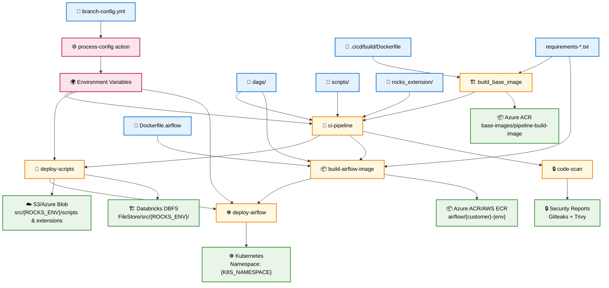
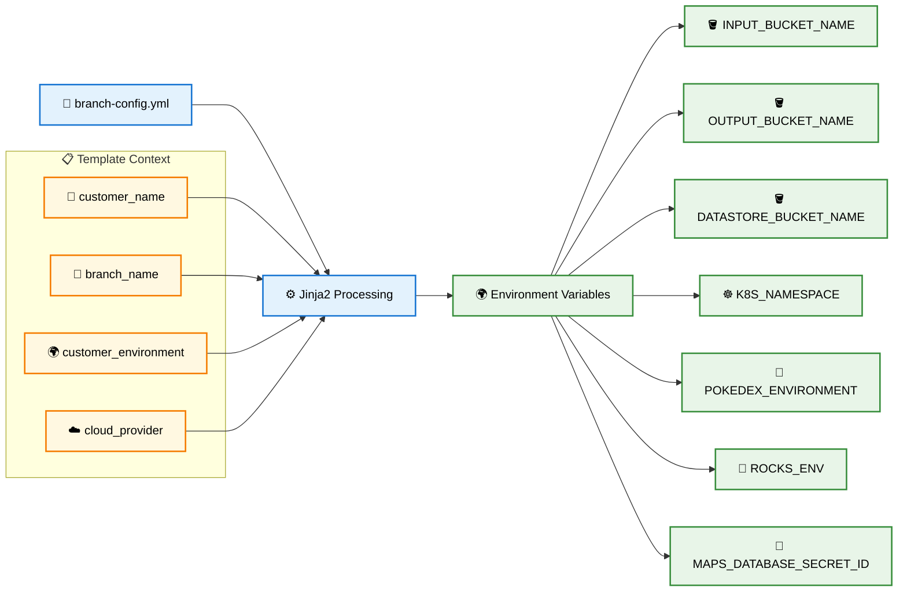

# GitHub Actions CI/CD Pipeline Architecture

## 🎯 **Simple Input/Output Overview**

```mermaid
graph LR
    subgraph inputs["📥 INPUTS"]
        I1["📄 branch-config.yml"]
        I2["🐳 .cicd/build/Dockerfile"]
        I3["🐳 Dockerfile.airflow"]
        I4["📋 requirements-*.txt"]
        I5["🎯 dags/"]
        I6["📜 scripts/"]
        I7["🔧 rocks_extension/"]
    end

    subgraph cicd["🔄 CI/CD PIPELINE"]
        P["⚙️ GitHub Actions<br/>Workflows"]
    end

    subgraph outputs["📤 OUTPUTS"]
        subgraph images["🐳 Container Images"]
            O1["📦 Base Build Image<br/>inventkubernetes.azurecr.io/<br/>base-images/pipeline-build-image"]
            O2["📦 Airflow Image<br/>inventkubernetes.azurecr.io/<br/>airflow/{customer}-{env}"]
        end
        
        subgraph storage["☁️ Object Storage"]
            O3["🪣 AWS S3 (if aws)<br/>s3://{DATASTORE_BUCKET}/<br/>src/{ROCKS_ENV}/"]
            O4["🪣 Azure Blob (if azure)<br/>{STORAGE_ACCOUNT}/<br/>{DATASTORE_BUCKET}/<br/>src/{ROCKS_ENV}/"]
        end
        
        subgraph databricks["🏗️ Databricks DBFS"]
            O5["📁 dbfs:/FileStore/<br/>src/{ROCKS_ENV}/<br/>├── scripts/<br/>├── rocks_extension/<br/>├── internal_packages.lock<br/>└── requirements_spark.txt"]
        end
        
        subgraph kubernetes["☸️ Kubernetes"]
            O6["🎯 Namespace: {K8S_NAMESPACE}<br/>├── airflow-scheduler<br/>├── airflow-webserver<br/>└── airflow-worker"]
        end
    end

    %% Flow
    inputs --> cicd
    cicd --> outputs

    %% Styling
    classDef input fill:#e3f2fd,stroke:#1976d2,stroke-width:2px,color:#000
    classDef pipeline fill:#fff8e1,stroke:#f57c00,stroke-width:3px,color:#000
    classDef output fill:#e8f5e8,stroke:#388e3c,stroke-width:2px,color:#000

    class I1,I2,I3,I4,I5,I6,I7 input
    class P pipeline
    class O1,O2,O3,O4,O5,O6 output
```



## 📂 **Detailed Output Paths**

### **🐳 Container Images**
```
📦 Base Build Image:
   inventkubernetes.azurecr.io/base-images/pipeline-build-image:{dockerfile-hash}-{requirements-hash}

📦 Airflow Image:
   Azure: inventkubernetes.azurecr.io/airflow/{customer}-{image_env}:{version}
   AWS:   {AWS_ACCOUNT}.dkr.ecr.eu-west-1.amazonaws.com/airflow/{customer}-{image_env}:{version}
```

### **☁️ Object Storage Paths**
```
🪣 AWS S3 Structure:
   s3://{DATASTORE_BUCKET_NAME}/src/{ROCKS_ENV}/
   ├── scripts/
   │   ├── *.py files
   │   └── subdirectories
   ├── rocks_extension/
   │   ├── *.py files  
   │   └── subdirectories
   ├── internal-packages.lock
   └── requirements_spark.txt

🪣 Azure Blob Structure:
   {STORAGE_ACCOUNT_NAME}/{DATASTORE_BUCKET_NAME}/src/{ROCKS_ENV}/
   ├── scripts/
   └── rocks_extension/
```

### **🏗️ Databricks DBFS Paths**
```
📁 DBFS Structure:
   dbfs:/FileStore/src/{ROCKS_ENV}/
   ├── scripts/
   ├── rocks_extension/
   ├── module_runner.py
   ├── internal_packages.lock
   └── requirements_spark.txt
```

### **☸️ Kubernetes Deployments**
```
🎯 Namespace: {K8S_NAMESPACE} (typically: {customer_name})
   
📦 Airflow Components:
   ├── airflow-scheduler (Deployment)
   ├── airflow-webserver (Deployment + Service)
   ├── airflow-worker (Deployment, if CeleryExecutor)
   ├── ConfigMaps (airflow.cfg, environment variables)
   └── Secrets (database connections, Fernet key)
```

### **🌍 Environment Variable Examples**
```yaml
# Generated from branch-config.yml + Jinja2
INPUT_BUCKET_NAME: "invent-{customer_name}-input"
OUTPUT_BUCKET_NAME: "invent-{customer_name}-output"  
DATASTORE_BUCKET_NAME: "invent-{customer_name}-wba-datastore"
K8S_NAMESPACE: "{customer_name}"
POKEDEX_ENVIRONMENT: "wba" | "dev"
ROCKS_ENV: "prod" | "dev"
MAPS_DATABASE_SECRET_ID: "{customer}-{env}-app"
```

## 📋 Pipeline Overview



## 🔧 Detailed Job Structure

### **`build_base_image`**
```yaml
INPUTS:
  📁 .cicd/build/Dockerfile
  📁 requirements-*.txt (build, spark, airflow)
  🔐 Azure/AWS credentials

PROCESSING:
  - Hash Dockerfile + requirements → image tag
  - Check if image exists in registry
  - Build & push if not exists

OUTPUTS:
  📦 inventkubernetes.azurecr.io/base-images/pipeline-build-image:{tag}
  🏷️ image_tag (for ci-pipeline job)
```

### **`ci-pipeline`**
```yaml
DEPENDS ON: build_base_image

INPUTS:
  🖼️ Base image from build_base_image
  📁 branch-config.yml
  📁 dags/, scripts/, rocks_extension/
  🔧 Customer variables (CUSTOMER_NAME, etc.)

PROCESSING:
  🔄 process-config action:
    - branch-config.yml + Jinja2 → environment variables
  🧪 Tests:
    - Linting (flake8, pylint) 
    - Airflow unit tests
    - Rocks unit tests (optional)
    - Metadata checks

OUTPUTS:
  ✅ Test results
  🌍 Environment variables for other jobs:
    - INPUT_BUCKET_NAME, OUTPUT_BUCKET_NAME
    - DATASTORE_BUCKET_NAME, K8S_NAMESPACE
    - POKEDEX_ENVIRONMENT, ROCKS_ENV
```

### **`deploy-scripts`**
```yaml
DEPENDS ON: ci-pipeline (tests pass)

INPUTS:
  📁 scripts/, rocks_extension/
  📁 requirements-spark.txt
  🌍 Environment vars from ci-pipeline
  
PROCESSING:
  - Generate internal-packages.lock
  - Upload to cloud storage & Databricks

OUTPUTS:
  ☁️ AWS S3 (if aws):
    s3://{DATASTORE_BUCKET}/src/{ROCKS_ENV}/
      ├── scripts/
      ├── rocks_extension/  
      └── requirements_spark.txt
      
  ☁️ Azure Blob (if azure):
    {STORAGE_ACCOUNT}/{DATASTORE_BUCKET}/src/{ROCKS_ENV}/
      ├── scripts/
      └── rocks_extension/
      
  🏗️ Databricks DBFS:
    dbfs:/FileStore/src/{ROCKS_ENV}/
      ├── scripts/
      ├── rocks_extension/
      ├── internal_packages.lock
      └── requirements_spark.txt
```

### **`build-airflow-image`**
```yaml
RUNS IN PARALLEL with deploy-scripts

INPUTS:
  📁 Dockerfile.airflow
  📁 requirements-airflow.txt
  📁 dags/
  
PROCESSING:
  - Hash Dockerfile + requirements + dags → version
  - Build & push Airflow image
  - Tag based on branch (prod/dev/uat)

OUTPUTS:
  📦 Airflow Image:
    AWS: {AWS_ACCOUNT}.dkr.ecr.eu-west-1.amazonaws.com/airflow/{customer}
    Azure: inventkubernetes.azurecr.io/airflow/{customer}
  🏷️ airflow_image_version
```

### **`deploy-airflow`**
```yaml
DEPENDS ON: build-airflow-image + deploy-scripts + ci-pipeline

INPUTS:
  🏷️ airflow_image_version from build-airflow-image  
  📁 k8s manifests (from external repo)
  🌍 Environment variables
  
PROCESSING:
  - Checkout k8s infrastructure repo
  - Apply Jinja2 templating to k8s manifests
  - kubectl apply to target cluster

OUTPUTS:
  ☸️ Kubernetes Deployments:
    Namespace: {K8S_NAMESPACE}
    ├── airflow-scheduler
    ├── airflow-webserver  
    └── airflow-worker (if CeleryExecutor)
```

### **`code-scan`** (Parallel)
```yaml
RUNS IN PARALLEL with all jobs

INPUTS:
  📁 Full repository code
  
PROCESSING:
  - Gitleaks (secret scanning)
  - Trivy (vulnerability scanning)
  
OUTPUTS:
  🔒 Security scan results
  📊 Vulnerability reports
```

## 🌍 Environment Variables Flow



## 📦 Key File Dependencies

| File/Directory | Used By | Purpose |
|----------------|---------|---------|
| `branch-config.yml` | All jobs | Branch-specific configuration |
| `.cicd/build/Dockerfile` | `build_base_image` | Base build environment |
| `Dockerfile.airflow` | `build-airflow-image` | Airflow runtime environment |
| `requirements-*.txt` | `build_base_image`, `deploy-scripts`, `build-airflow-image` | Python dependencies |
| `dags/` | `ci-pipeline`, `build-airflow-image` | Airflow DAGs |
| `scripts/` | `ci-pipeline`, `deploy-scripts` | Processing scripts |
| `rocks_extension/` | `ci-pipeline`, `deploy-scripts` | Custom modules |

## 🔄 Conditional Execution

- **Feature branches**: All jobs run
- **Main/Master**: Production deployments 
- **PR closed**: Cleanup jobs (not shown)
- **Cloud provider**: AWS vs Azure paths
- **Test toggles**: Individual test suites can be disabled
