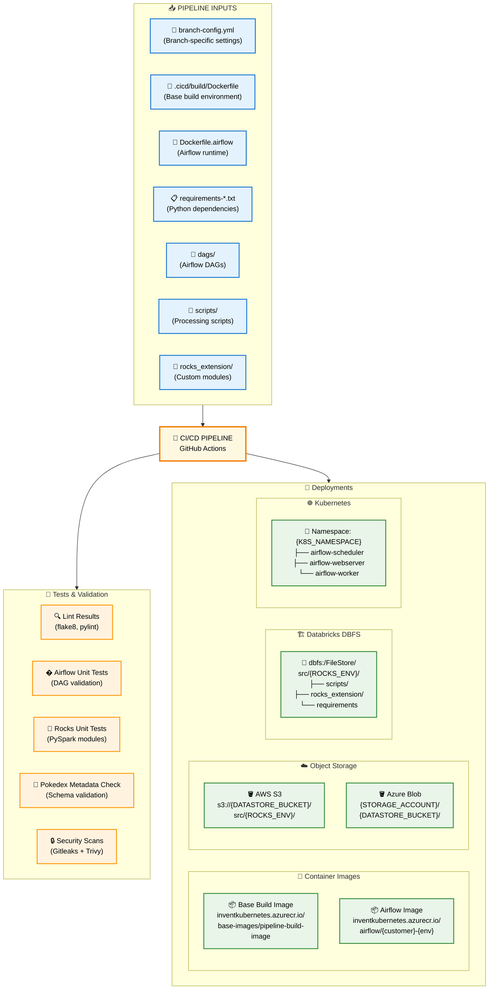

# CI/CD Pipeline - Simple Input/Output View

## 🎯 **Pipeline Flow Overview**



## 📂 **Test & Validation Outputs**

### **🧪 Test Results**
```bash
🔍 Lint Results:
   - flake8 output (code style violations)
   - pylint reports (code quality metrics)
   - Exit codes: 0 (pass) or >0 (issues found)

🎯 Airflow Unit Tests:
   - DAG syntax validation
   - Import tests for all DAGs
   - Task dependency verification
   - Custom operator testing

🗿 Rocks Unit Tests:
   - PySpark module testing
   - Data transformation validation
   - Custom function unit tests
   - Integration test results

🦄 Pokedex Metadata Check:
   - Schema validation against metadata repository
   - Table structure verification
   - Column type consistency checks
   - Data lineage validation

🔒 Security Scan Results:
   - Gitleaks: Secret detection in code/history
   - Trivy: Vulnerability scanning (dependencies & containers)
   - SARIF reports uploaded to GitHub Security tab
```

## 📂 **Deployment Outputs**

### **🐳 Container Images**
```bash
# Base Build Image (cached, reused across builds)
inventkubernetes.azurecr.io/base-images/pipeline-build-image:{hash}

# Airflow Images (per customer/environment)
Azure: inventkubernetes.azurecr.io/airflow/{customer}-{env}:{version}
AWS:   {account}.dkr.ecr.eu-west-1.amazonaws.com/airflow/{customer}-{env}:{version}
```

### **☁️ Object Storage Paths**
```bash
# AWS S3 Structure
s3://{DATASTORE_BUCKET_NAME}/src/{ROCKS_ENV}/
├── scripts/                    # Processing scripts
├── rocks_extension/            # Custom Python modules  
├── internal-packages.lock      # Dependency lock file
└── requirements_spark.txt      # Spark requirements

# Azure Blob Structure  
{STORAGE_ACCOUNT}/{DATASTORE_BUCKET}/src/{ROCKS_ENV}/
├── scripts/
└── rocks_extension/
```

### **🏗️ Databricks DBFS**
```bash
dbfs:/FileStore/src/{ROCKS_ENV}/
├── scripts/                    # Same as object storage
├── rocks_extension/            # Same as object storage
├── module_runner.py            # Execution wrapper
├── internal_packages.lock      # Dependency management
└── requirements_spark.txt      # Spark dependencies
```

### **☸️ Kubernetes Deployments**
```yaml
Namespace: {K8S_NAMESPACE}      # Typically: customer name

Deployments:
  - airflow-scheduler           # DAG scheduling
  - airflow-webserver          # Web UI + API
  - airflow-worker             # Task execution (if Celery)

ConfigMaps:
  - airflow-config             # airflow.cfg
  - environment-variables      # From branch-config.yml

Secrets:
  - database-connection        # Airflow metadata DB
  - fernet-key                # Encryption key
  - cloud-credentials         # AWS/Azure access
```

## 🌍 **Configuration Variables**

Generated from `branch-config.yml` using **Jinja2 templating**:

| Variable | Example Value | Purpose |
|----------|---------------|---------|
| `INPUT_BUCKET_NAME` | `invent-{customer}-input` | Data input bucket |
| `OUTPUT_BUCKET_NAME` | `invent-{customer}-output` | Results bucket |
| `DATASTORE_BUCKET_NAME` | `invent-{customer}-wba-datastore` | Scripts/code storage |
| `K8S_NAMESPACE` | `{customer_name}` | Kubernetes isolation |
| `POKEDEX_ENVIRONMENT` | `wba` / `dev` | Metadata environment |
| `ROCKS_ENV` | `prod` / `dev` | Processing environment |
| `MAPS_DATABASE_SECRET_ID` | `{customer}-{env}-app` | Database credentials |

## 🔄 **Branch-Based Behavior**

| Branch | Environment | Image Tag | Storage Path | K8s Namespace |
|--------|-------------|-----------|--------------|---------------|
| `main` | Production | `prod` | `/prod/` | `{customer}` |
| `dev` | Development | `dev` | `/dev/` | `{customer}-dev` |
| `feature/*` | Feature | `dev` | `/dev/` | `{customer}-dev` |
| `uat` | UAT | `uat` | `/uat/` | `{customer}-uat` |

The pipeline automatically deploys to different environments based on the Git branch, with all paths and configurations dynamically generated from the `branch-config.yml` template.